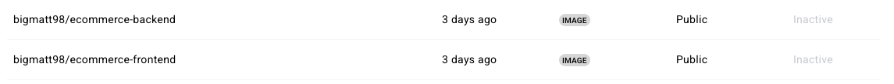

## 1. Choice of base image in each container.
---------------------------------------

Back end
--------

For back end i used node:14 which has an environment ideal for installation of all the required dependencies. For the second stage i used alpine:3.16.7, a minimal Linux distribution helps reduce the size of th image. I installed nodejs and npm manually in this stage, ensuring only the required runtime components are present. This resulted in a secure and lean image.

Front end
---------
The frontend also uses a multi-stage build. The first stage uses node:14-slim to install and build the web application. The second stage uses "nginx:alpine" to serve the static files. Nginx is a web server used to serve production builds of react applications. The alpine version of nginx helps reduce the size of the image.

Mongo-DB
-----
This was used because it doesnt require a lot of setup and it is easy to use. 

2. Dockerfile Directives Used in Each Container
-----------------------------------------------

### Backend

The backend Dockerfile uses a **multi-stage build**:

- `FROM node:14 AS build` – Uses the full Node.js image to install dependencies and copy the application code.
- `WORKDIR /usr/src/app` – Sets the working directory inside the container.
- `COPY package*.json ./` and `RUN npm install` – Installs dependencies based on the package files.
- `COPY . .` – Copies all application files.
- `FROM alpine:3.16.7` – Switches to a lightweight Alpine Linux image for the final build.
- `RUN apk update && apk add --no-cache nodejs npm` – Installs only necessary Node.js runtime for production.
- `COPY --from=build /usr/src/app /app` – Copies the prepared code from the build stage.
- `EXPOSE 5000` – Exposes port 5000 used by the Express server.
- `CMD ["node", "server.js"]` – Starts the backend server.

This combination ensures a clean, efficient image ready for production with minimal dependencies.

### Frontend

The frontend Dockerfile also uses a **multi-stage build**:

- `FROM node:14-slim AS build` – Slim variant of Node.js to reduce build size.
- `WORKDIR /usr/src/app` – Sets the working directory.
- `COPY package*.json ./` and `RUN npm install` – Installs React app project dependencies.
- `COPY . .` – Adds all the source code.
- `RUN npm run build` – To build a production ready react application.

The second stage:

- `FROM nginx:alpine` – Uses Nginx to serve static files efficiently.
- `COPY --from=build /usr/src/app/build /usr/share/nginx/html` – Places the React build output in Nginx’s root directory.
- `EXPOSE 80` – Exposes port 80.
- `CMD ["nginx", "-g", "daemon off;"]` – Starts Nginx in the foreground to keep the container running.

This approach ensures the app is served through a fast, lightweight web server.

### MongoDB

The MongoDB service uses the official `mongo` image, which includes its own entrypoint. No custom Dockerfile needed, and port `27017` was exposed for database access.

 3. Docker-compose Networking (Port allocation for the app and a bridge network implementation)
 ----------------------------------------------------------------------------------------------
 I used bridge drivers because the bridge driver allows for isolated communication between containers while also enabling external traffic routing to exposed ports.
 I used a bridge network called `app.net` that i configured in docker-compose.yml. Through this network each service can resolve and communicate with each other using their repective container names. I have used custom ip adresses(subnet and ip range) to avoid conflicts with other docker networks.  
# port allocation
 front-end (mattfront-client)
 Mapped port 3000 on the host to container port 80, since the React build is served by Nginx.
 ports:
  - "3000:80"

 back-end (mattback-backend)
 Mapped port 5000 on the host to container port 5000, where the Express server runs.
 ports:
  - "5000:5000"

MongoDB (app-ip-mongo)
Exposed on port 27017, allowing local database inspection or testing if necessary.
 ports:
  - "27017:27017"

 4. Docker-compose Volume Definition and Usage
 ----------------------------------------------------------------------------------------------
To persist data generated by the MongoDB service across container restarts and rebuilds, I defined and used a named Docker volume in the `docker-compose.yml` file.
volumes:
  app-mongo-data:
    driver: local

This volume is mounted to the mongoDB as follows:
 volumes:
      - type: volume
        source: app-mongo-data
        target: /data/db

Docker volumes ensures that the database retains its state even if the container is stopped, removed, or rebuilt.     

 5. Git workflow
 ----------------------------------------------------------------------------------------------
After forking the project from the repository provided i cloned the project into my device using 
`git clone <repourl>`
I have used git add . to stage all the changes (new files, modifications, deletions) in my directory to be committed. All the changes have been pushed to master branch in the project.
i have made frequent commits at different stages throught the project.
A .gitignore file was used to prevent unnecessary files and directories.
After all the tests had been i finally used `git push` to push all the adjusted Dockerfiles, docker-compose and explation.md files.

6. Successful Running of the Applications and Debugging Measures Applied
# Running the application
After defining the docker-compose.yml i run the commands:
   a. docker-compose build
   b. docker-compose up

These commands:

    Built the Docker images for the client, backend, and MongoDB.
    Started all containers using the defined configurations (ports, volumes, networks).

Once the containers were up and running i looked at the client( front-end on localhost:3000).
# Running the application
There was a mismatch of ports.The frontend was exposing port 80, but I was accessing localhost:3000. Updating the mapping to 3000:80 in the docker-compose.yml fixed this.
Database connectivity: I set MONGODB_URI in the backend to mongodb://app-ip-mongo/yolomy to match the MongoDB service name in Docker Compose.
Logs inspection: I used docker logs <container_name> and docker-compose logs to check for errors like failed connections or missing files.

7. Good Practices (Docker image tag naming, etc.)
    To maintain clarity and consistency across images, i used a standardized naming convention that follows this format: <dockerhub-username>/<project-name>-<service>:<version>  so it looks like bigmatt98/ecommerce-frontend:1.0.0 and bigmatt98/ecommerce-backend:1.0.1 for backend. This helps identify the different services frontend and backend, the owner of the service bigmatt98 and the version v1.0.0.

    Multi-stage builds: Multi staging was used in both front end and backend this helped reduce the  final size image separating the build environment from the runtime image.
    Using slim and alpine images: This kept the images light weight. node:14-slim and nginx both helped keep the images small. The images sizes are as follows 50mb- frontend and 87mb - backend. 
    Port mapping consistency:
    Clearly exposed and mapped internal ports to host machine:
        Backend: 5000:5000  Frontend (Nginx): 3000:80
    Container naming:
    Explicitly set using container_name to avoid confusion during development and debugging.
    Network isolation:
    Used a custom bridge network (app-net) to isolate application communication and avoid port conflicts with other Docker services on the system.
    Persistent storage with Docker Volumes:
        Defined app-mongo-data to persist MongoDB data between container restarts or rebuilds.

8. Screenshots
# Screenshot of Deployed Images on DockerHub

.
    

    

    
# Explanation of Ansible Playbook Execution

## Order of Tasks/Roles in `playbook.yml`

The Ansible playbook is structured to provision a Vagrant-based Ubuntu virtual machine and deploy a containerized e-commerce application. The tasks/roles run in the following order:

1. **docker**  - docker-setup
   Installs Docker and Docker Compose on the Vagrant VM.
2. **network** - network_setup
   Creates the network app-net and volume app-mongo-data for use in the other containers.
2. **mongodb** - setup-mongodb 
   Pulls and runs the MongoDB container to ensure data persistence is ready.
3. **backend**  - backend-deployment
   Clones the backend service code, builds its Docker image, and runs the container.
4. **frontend**  - frontend-deployment
   Does the same for the frontend (React) application.

## Pretasks 
Pre-Tasks

Before executing the main roles of the playbook, several important pre-tasks are performed to prepare the system environment:

    **Create Keyrings Directory**
    The directory /etc/apt/keyrings is created to securely store GPG keys for APT repositories.

    -Add Docker GPG Key
    The official Docker GPG key is downloaded and saved in the keyrings directory. This key is required to verify the authenticity of packages downloaded from Docker’s APT repository.

    -Clean Up Old Docker Repositories (if any)
    Any previously added Docker APT repositories are removed to avoid conflicts or duplication.

    -Add Docker APT Repository
    The correct Docker APT repository is added with the signed-by option to ensure secure installation using the previously saved GPG key.

    -Update APT Cache
    The APT package index is updated to make sure the latest package information is used.

    -Install Prerequisite Packages
    Core packages such as git, curl, and python3-pip are installed. These are necessary for fetching code, managing Python packages, and enabling further automation.

    -Install Python Docker Module
    The docker Python module is installed using pip. This module is essential for Ansible's Docker-related tasks and modules to function correctly in subsequent roles.

    These pre-tasks ensure the target machine is fully prepared for the containerization and deployment steps that follow. 

## Why the Order Matters

- Docker must be installed first, as all other services depend on it.
- Network runs second so that we can have the shared volume and network for use in the other      containers
- MongoDB should start before backend so the Node.js backend can successfully connect.
- Backend must run before frontend to expose API endpoints for the UI.
- Frontend runs last, as it typically connects to the backend via environment variables or container linking.

## Role Descriptions

### `docker-setup`
- Installs Docker and Docker Compose using apt and the `docker` official repo.
- Ensures `docker` service is enabled and running.

### `network_setup`
- Installs Docker and Docker Compose using apt and the `docker` official repo.
- Ensures `docker` service is enabled and running.

### `setup-mongodb`
- Pulls the official MongoDB Docker image.
- Runs a container with data persistence via volume mapping.

### `backend-deployment`
- Uses `git` to clone the backend repository.
- Builds the backend Docker image using `docker_image`.
- Runs the container with environment variables and links to MongoDB.

### `frontend-deployment`
- Clones the frontend React repo.
- Builds the image and serves it via a container (e.g., with Nginx or `npm run start`).
- Maps port `3000` to host for UI access.

## Ansible Modules Used

| Module           | Purpose                                      |
|------------------|----------------------------------------------|
| `apt`            | Install system packages like Docker          |
| `docker_container` | Start/stop Docker containers               |
| `docker_image`   | Build images from Dockerfiles                |
| `git`            | Clone code repositories                      |
| `copy`           | Transfer configuration files if needed       |
| `template`       | Used to create `.env` or config files        |
| `file`           | Create directories or set permissions        |

    
## 1. Choice of Kubernetes Objects Used for Deployment

For this project, I used the following Kubernetes objects:

- **StatefulSet** for the MongoDB database:
  - This was chosen over a Deployment because StatefulSets provide stable network identities and persistent storage, which are essential for databases.
  - The `volumeClaimTemplates` ensure that the data persists even if the pod is deleted or rescheduled.
- **Deployments** for frontend and backend:
  - Deployments are suitable for stateless applications like the frontend UI and backend API because they manage rolling updates and scaling efficiently.
- **Services**:
  - I created a **Headless Service** for MongoDB to allow stable DNS names for each pod in the StatefulSet.
  - For frontend and backend, I used LoadBalancer services to expose pods externally.

---

## 2. Method Used to Expose Your Pods to Internet Traffic

- The frontend application is exposed using a **LoadBalancer Service**, which provides an external IP to access the app from the internet.
- Backend services are exposed via **LoadBalancer Service** services for communication between pods.
- MongoDB is only exposed internally through the Headless Service to maintain security and stability.

---

## 3. Use of Persistent Storage

- Persistent storage is implemented through **PersistentVolumeClaims** defined in the `volumeClaimTemplates` of the MongoDB StatefulSet.
- This ensures that database data is not lost when pods are recreated or rescheduled.
- Storage class `standard-rwo` was used to provide ReadWriteOnce access mode, appropriate for single-writer database usage.
- I verified that deleting the MongoDB pod does not lead to loss of data, confirming persistent storage functionality.

---

## 4. Running Application and Debugging Measures

- The application is deployed on **Google Kubernetes Engine (GKE)** using tagged Docker Hub images.
- Pods for frontend, backend, and database all run successfully.
- I verified the frontend is accessible via the external IP of the LoadBalancer service.
- Debugging included checking pod logs, events, and resource usage to resolve scheduling and image pull issues.
- I addressed persistent volume claims by configuring the correct storage class and volume claim templates.

---

## 5. Good Practices in Docker Image Tag Naming

- Docker images for frontend, backend, and MongoDB are tagged with:
  - Descriptive names reflecting the service (e.g., `frontend:v1.0.5`, `backend:1.0.2`).
  - Versioning tags allow clear identification of deployed versions.
- Images are stored on Docker Hub for easy access by the GKE cluster.
- Manifest files reference these tagged images explicitly to ensure reproducible deployments.